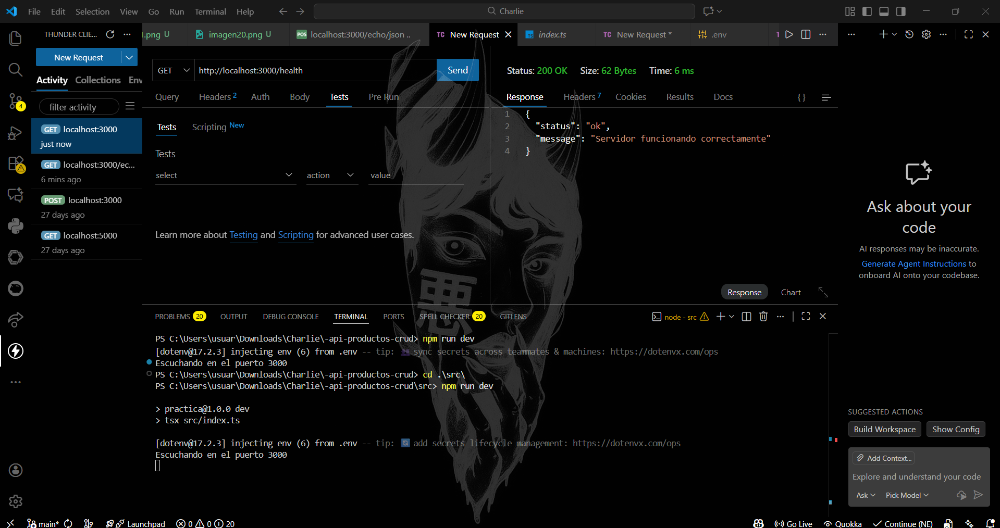
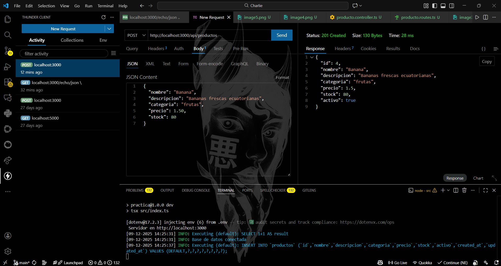
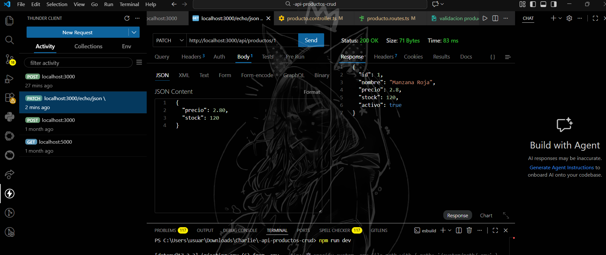
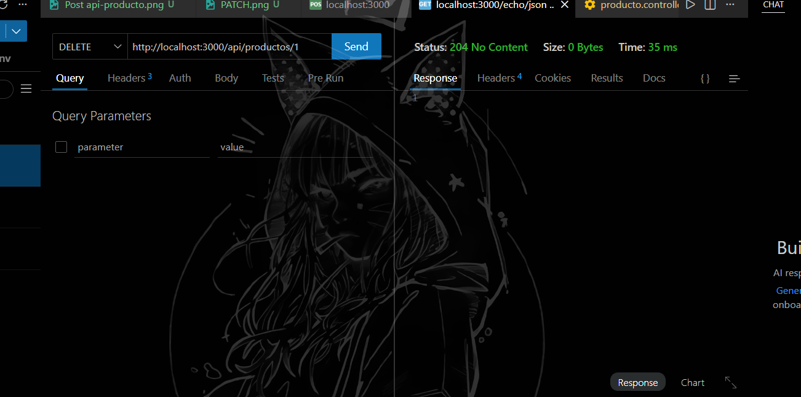
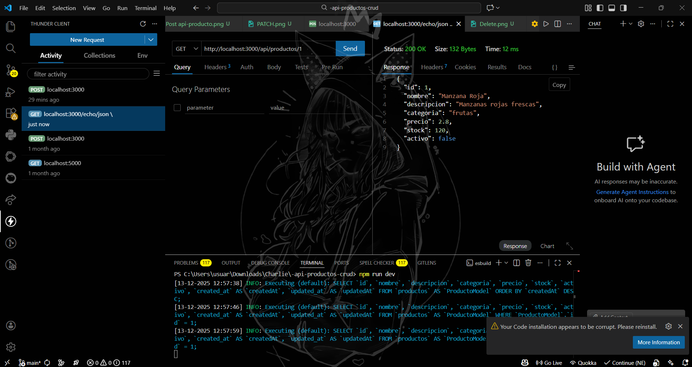
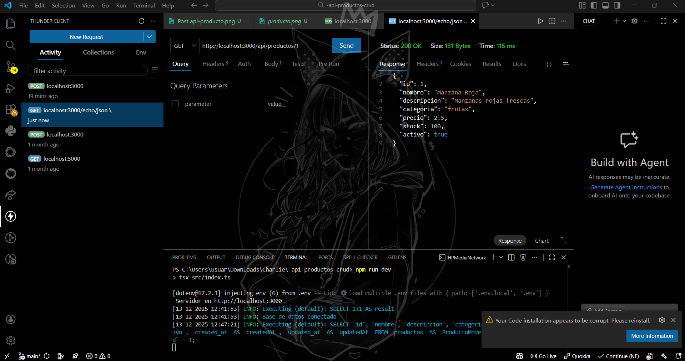

# API Productos CRUD

API REST desarrollada con Node.js, Express y TypeScript para la gestión de productos. El proyecto implementa operaciones CRUD completas, validaciones de datos y manejo adecuado de errores, utilizando una base de datos MySQL con Sequelize.

---

## Tecnologías utilizadas

* Node.js
* Express
* TypeScript
* Sequelize ORM
* MySQL
* Thunder Client / Postman

---

## Descripción general

La API permite:

* Crear productos
* Listar productos
* Obtener un producto por ID
* Actualizar productos
* Eliminar productos (borrado lógico)

Se valida la información recibida y se devuelven códigos HTTP apropiados según el resultado de cada operación.

---

## Endpoints principales

### Crear producto

**POST** `/api/productos`

Crea un nuevo producto en la base de datos.

---

### Listar productos

**GET** `/api/productos`

Devuelve todos los productos registrados.

---

### Obtener producto por ID

**GET** `/api/productos/:id`

Devuelve la información de un producto específico.

---

### Actualizar producto

**PATCH** `/api/productos/:id`

Actualiza parcialmente un producto existente.

---

### Eliminar producto

**DELETE** `/api/productos/:id`

Desactiva un producto mediante borrado lógico.

---

## Manejo de errores

La API maneja los siguientes casos:

* 400: Datos inválidos o incompletos
* 404: Producto no encontrado
* 500: Error interno del servidor

---

## Evidencia de pruebas unitarias / pruebas de endpoints

A continuación se presentan capturas que evidencian el correcto funcionamiento de la API durante las pruebas realizadas con un cliente REST.
### Servidor y conexión

### Servidor y conexión

### Conexión

---

### Modelo y estructura de datos

---

### Operaciones CRUD

**GET productos**

**POST producto**

**PATCH producto**

**DELETE producto**

**DELETE producto desactivado**

---

### Validaciones:

### Errores:

---

## Conclusión

El proyecto cumple con los requisitos de una API REST CRUD funcional, aplicando validaciones, control de errores y buenas prácticas de desarrollo backend.
